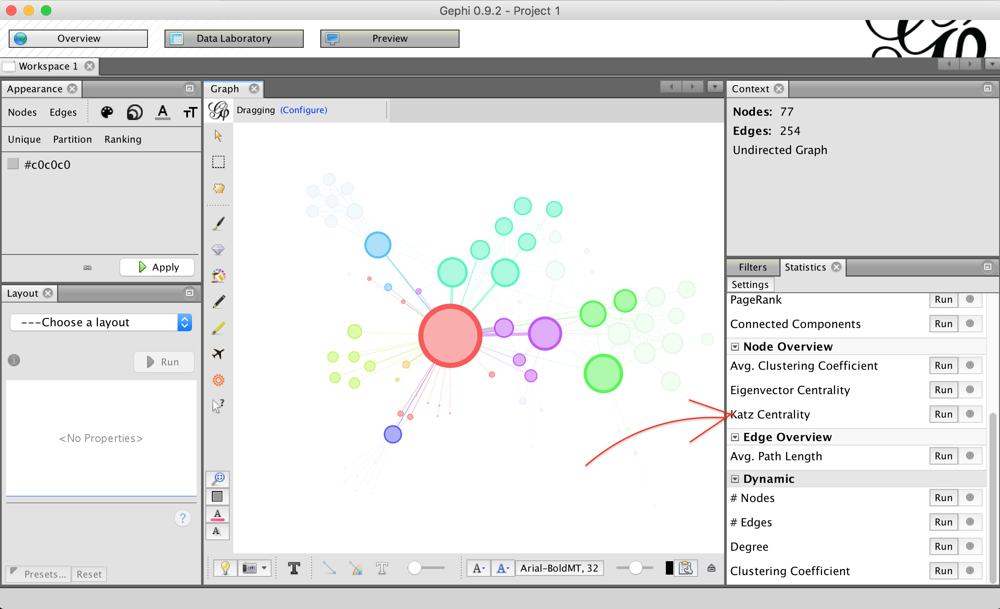

## Katz Centrality

The plugin was developed under the initiative of the [Open University Of Israel](https://www.openu.ac.il/en/pages/default.aspx).

### The Algorithm Description

For a network with `n` nodes, the `n x n` adjacency matrix `A` is the matrix
in which `a_ij = 1` when the network has an edge from node `i` to node `j`; and
`a_ij = 0` otherwise. In the particular case in which the network is undirected
we have `a_ij = a_ji`; i.e. the adjacency matrix is symmetric `A = A^T`. More
generally, if the edges are weighted, then `a_ij` is the weight of the edge from
node `i` to node `j`:
The Katz (sometimes also called Katz-Bonacich) centrality measures with
the parameter of the network nodes are defined by the `n x 1` vector:

### Installation

If the official Gephi distribution doesn't include this plugin yet, it can be installed as follows:

- open Gephi application
- go to Plugins menu, click on Downloaded tab, click Add plugins
- download `katz-centrality-1.0.0.nbm` [file](https://app.box.com/s/pcu10d0at159fehp24rb6jt9jpdqyi18) and click Install
- a dialog window will open, click Continue until the process is finished
- finally select Restart Now

After Gephi application re-opens the plugin will be available
under Statistics plugins:

